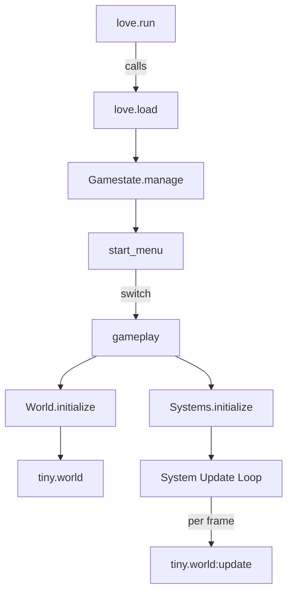

# Architecture Overview

Novus is a top-down space action prototype built on **LÖVE 11.5** with a **tiny-ecs** entity-component-system. This document summarizes the runtime flow, major modules, and how data moves through the simulation.

## High-Level Flow



1. `main.lua` sets up window/physics defaults, registers frame limiting, and hands control to **hump.gamestate**.
2. `start_menu` handles title UI. New/Load transitions switch to `src.states.gameplay`.
3. `gameplay` initializes the physics world, spawns the sector via blueprints, and wires ECS systems.
4. Each frame, Love2D pumps events, runs physics with a fixed timestep, then updates the TinyECS world.

## Key Modules

### Game State (`src/states/gameplay.lua`)
- Owns global simulation state (world, camera, player references).
- Coordinates save/load, docking, targeting, and the main update loop.
- Provides `GameContext` helpers (see below) to standardize system dependencies.

### Game Context (`src/states/gameplay/context.lua`)
- `GameContext.compose(state, overrides?)` creates a context carrying `resolveState`, `resolveLocalPlayer`, and optional physics callbacks.
- `GameContext.extend(context, overrides?)` clones existing contexts per system.
- Most systems receive context instead of direct state references, improving isolation.

### ECS Systems (`src/states/gameplay/systems.lua` & `src/systems/`)
- Systems are constructed via factories like `createMovementSystem` and registered in `Systems.initialize`.
- Context wiring injects shared resources (camera, uiInput, engine trails, etc.).
- Major system groups:
  - **Input & Control**: `input_local`, `player_control`
  - **Combat**: `weapon_logic`, `weapon_projectile_spawn`, `weapon_hitscan`, `weapon_beam_vfx`
  - **Simulation**: `movement`, `projectile`, `ship`, `enemy_ai`, `loot_drop`
  - **Rendering/UI**: `render`, `effects_renderer`, `hud`, `ui`

### Input Pipeline
- `input_local` reads mouse/keyboard, normalizes into **Intent** objects per player, and respects `uiInput.mouseCaptured`/`keyboardCaptured`.
- `src/input/mapper.lua` translates key bindings from `src/input/bindings.lua` into intents.
- Control modifiers (e.g., Ctrl for targeting) are handled directly in `input_local`.

### Blueprint System (`src/blueprints/`)
- Blueprints define ships, stations, modules, etc., validated against schemas.
- `loader.instantiate(category, id, context)` resolves a blueprint, runs validation, and delegates to category factories.
- Factories spawn physics fixtures, visuals, and components consistent with ECS expectations.

### Entity Management (`src/states/gameplay/entities.lua`)
- Provides helpers for spawning stations, warpgates, pickups, and the player ship.
- Resolves spawn positions near stations or within world bounds.
- Coordinates with `PlayerManager` to register the local player.

### Player & Items (`src/player/`) 
- `PlayerManager` tracks player currency, pilot progression, and active ship.
- `src/player/weapons.lua` handles weapon loadouts and slot logic.
- Items live in `src/items/`, with registries instantiating consumables, modules, and cargo.

### Audio & Effects
- `src/audio/manager.lua` centralizes sound playback and mixers.
- `src/effects/` covers visual embellishments (floating text, engine trails).
- `assets/` stores all media; the manager respects runtime settings for volumes.

## Persistence Pipeline

### Component Registry (`src/util/component_registry.lua`)
- Lists serializable components with custom `serialize/deserialize` functions where needed.
- Enables consistent save/load logic without per-entity boilerplate.

### Entity Serializer (`src/util/entity_serializer.lua`)
1. Skips transient entities (projectiles, debug props).
2. Serializes payload using the component registry.
3. Derives an archetype and stable ID for each entity.

### Save/Load (`src/util/save_load.lua`)
- `SaveLoad.serialize(state)` gathers player ship snapshot, world entities, quests.
- Writes JSON via `love.filesystem`; `savegame.json` lives in the LÖVE save directory.
- Load path recreates entities using blueprints, then rehydrates components and physics state.

## UI Stack
- **UI State Manager**: tracks modal windows and captures input (`uiInput` flags).
- **HUD System**: draws overlays (health, minimap, target locks).
- **UI System**: renders interactive windows; clicking over UI sets `uiInput.mouseCaptured` to prevent firing weapons.
- UI components reside under `src/ui/components/` with factories in `src/ui/state/factories.lua`.

## Extending the Game

1. **New System**: add a factory in `src/systems/`, register in `Systems.initialize`, and update docs if inputs or context change.
2. **New Entity/Blueprint**: add definitions under `src/blueprints/<category>/`, update schema if new fields are required, and make sure serialization handles custom components (via `ComponentRegistry`).
3. **New Input**: extend `bindings.lua` and teach `input_local`/`player_control` how to use it.
4. **New UI Window**: build a component, register with `UIStateManager`, and set `uiInput` captures appropriately.

## Reference Diagram

```
               ┌─────────────────────┐
               │      love.run       │
               └─────────┬──────────┘
                         │
                ┌────────▼─────────┐
                │    Gamestate     │
                └────────┬────────┘
                         │
                ┌────────▼────────┐
                │    gameplay     │
                └──────┬┬┬───────┘
                       │││
          ┌────────────┘│└────────────┐
          ▼             ▼             ▼
   World.initialize  Systems.init   Entities.spawn
          │             │             │
          ▼             ▼             ▼
   love.physics    tiny.world    Blueprint loader
          │             │             │
          └─────► ECS update ◄───────┘
```

Keep this overview handy as you explore the codebase. When in doubt, trace the flow from `gameplay:enter()` to the systems it wires up.
